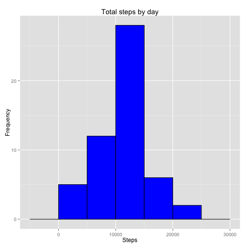
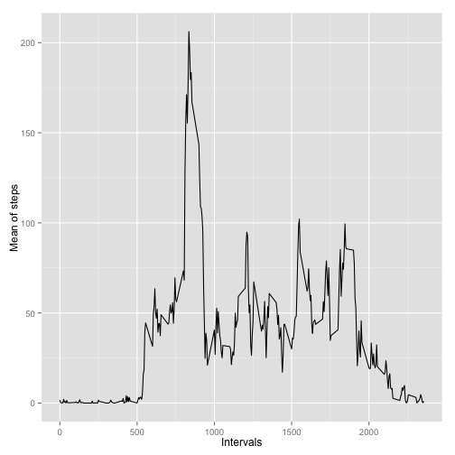
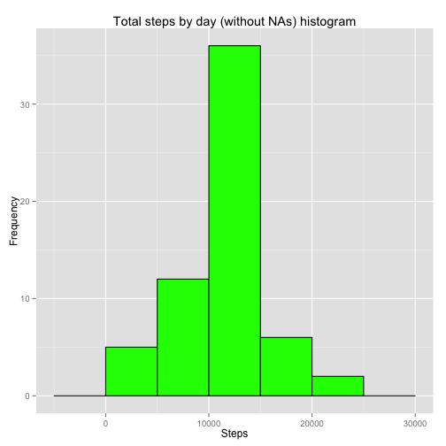
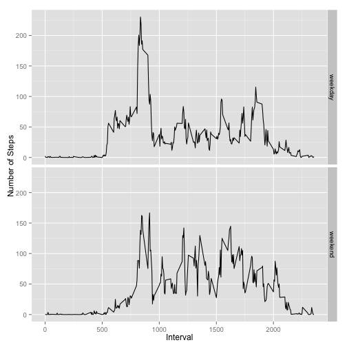

## Loading and preprocessing the data


```r
library(dplyr, warn.conflicts = FALSE)
library(ggplot2)

# Load the data (i.e. read.csv())
activity <- read.csv('activity.csv')

# Process/transform the data (if necessary) into a format suitable for your analysis
filteredActivity <- filter(activity, !is.na(steps))
```


## What is mean total number of steps taken per day?


```r
# Calculate the total number of steps taken per day
byDate <- group_by(filteredActivity, date)
totalStepsByDay <- summarise(byDate, steps = sum(steps))

# If you do not understand the difference between a histogram and a barplot, 
# research the difference between them. Make a histogram of the total number 
# of steps taken each day.
ggplot(totalStepsByDay, aes(x = steps)) +
    ggtitle("Total steps by day") +
    geom_histogram(binwidth = 5000, colour="black", fill = "blue") +
    xlab("Steps") + 
    ylab("Frequency")
```

 

```r
# Calculate and report the mean and median of the total number of steps taken per day
meanOfTotalStepsByDay <- mean(totalStepsByDay$steps)
medianOfTotalStepsByDay <- median(totalStepsByDay$steps)
```

Mean of total number of steps by day: 10766.19

Median of total number of steps by day: 10765

## What is the average daily activity pattern?


```r
# Make a time series plot (i.e. type = "l") of the 5-minute interval (x-axis) 
# and the average number of steps taken, averaged across all days (y-axis).
byInterval <- group_by(filteredActivity, interval)
meanOfstepsByInterval <- summarise(byInterval, meanOfSteps = mean(steps))
ggplot(meanOfstepsByInterval, aes(interval, meanOfSteps)) + 
    geom_line() +
    xlab("Intervals") + 
    ylab("Mean of steps")
```

 

```r
# Which 5-minute interval, on average across all the days in the dataset, 
# contains the maximum number of steps?
intervalWithMaxNumberOfSteps <- meanOfstepsByInterval %>% 
    filter(meanOfSteps == max(meanOfstepsByInterval$mean)) %>%
        select(interval)
```
Interval with maximum number of steps: 835

## Imputing missing values

```r
# Calculate and report the total number of missing values in the dataset (i.e.
# the total number of rows with NAs).
totalNumberOfNA <- sum(is.na(activity))
```
Total number of missing values: 2304


```r
# Devise a strategy for filling in all of the missing values in the dataset. 
# The strategy does not need to be sophisticated. For example, you could use 
# the mean/median for that day, or the mean for that 5-minute interval, etc.

# The strategy will be the use of mean of the corresponding interval, stored 
# in meanOfstepsByInterval.

# Create a new dataset that is equal to the original dataset but with the 
# missing data filled in.
activityWithoutNA <- 
    merge(x = activity, y = meanOfstepsByInterval) %>% 
    arrange(date, interval) %>% 
    mutate(stepsWithoutNA = ifelse(is.na(steps), meanOfSteps, steps))

# Make a histogram of the total number of steps taken each day and Calculate 
# and report the mean and median total number of steps taken per day. Do 
# these values differ from the estimates from the first part of the assignment? 
# What is the impact of imputing missing data on the estimates of the total 
# daily number of steps?
byDateWithoutNA <- group_by(activityWithoutNA, date)
totalStepsByDayWithoutNA <- summarise(byDateWithoutNA, steps = sum(stepsWithoutNA))

meanOfTotalNumberOfSteps <- mean(totalStepsByDayWithoutNA$steps)
medianOfTotalNumberOfSteps <- median(totalStepsByDayWithoutNA$steps)

ggplot(totalStepsByDayWithoutNA, aes(x = steps)) +
    ggtitle("Total steps by day (without NAs) histogram") +
    geom_histogram(binwidth = 5000, colour="black", fill = "green") +
    xlab("Steps") + 
    ylab("Frequency")
```

 

Mean of total number of steps by day (without NAs): 10766.19

Median of total number of steps by day (without NAs): 10766.19

The results differ (specifically the median) from the first part of the assignment, due to the strategy selected (replacing NA with the mean value of its interval). There is a shifting to right in the median value.

## Are there differences in activity patterns between weekdays and weekends?


```r
# Create a new factor variable in the dataset with two levels – “weekday” and
# “weekend” indicating whether a given date is a weekday or weekend day.
activityWithoutNA <-
  mutate(activityWithoutNA, 
         weekDay = ifelse(
           weekdays(as.Date(date)) %in% c("Sunday" , "Saturday"), 
           "weekend", "weekday"))
activityWithoutNA$weekDay <- as.factor(activityWithoutNA$weekDay)
byIntervalWeekDay <- group_by(activityWithoutNA, interval, weekDay)
meanOfstepsByIntervalWeekDay <- summarise(byIntervalWeekDay, meanOfSteps = mean(stepsWithoutNA))

# Make a panel plot containing a time series plot (i.e. type = "l") of the 
# 5-minute interval (x-axis) and the average number of steps taken, averaged 
# across all weekday days or weekend days (y-axis). See the README file in 
# the GitHub repository to see an example of what this plot should look like
# using simulated data.
ggplot(meanOfstepsByIntervalWeekDay, aes(x = interval, y = meanOfSteps), col(weekDay)) +
    geom_line() +
    ylab("Number of Steps") + 
    xlab("Interval") +
    facet_grid(weekDay~.)
```

 

